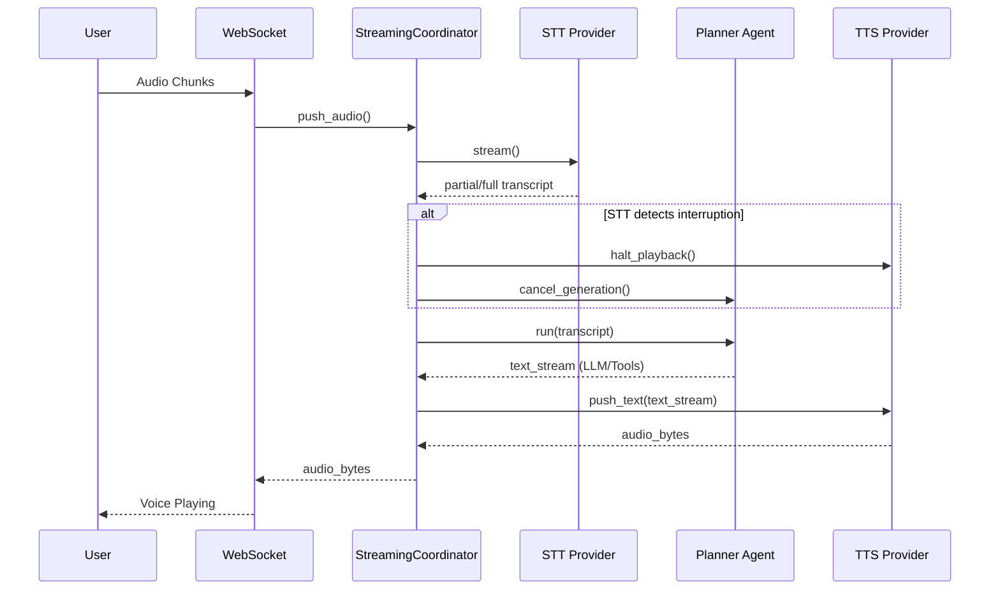

# Phase 0 – Project Foundation

## Vision
Build a modular, scalable, AI-first operating system that unifies chat, memory, notes, documents, calendar, tasks, voice, search, and autonomous agents into a single personalized platform.

## Architectural Principles

- Monorepo architecture for all applications and shared packages.
- Domain-Driven Design (DDD) with feature-based modules.
- Plugin-based architecture for future extensibility.
- Centralized LLM Gateway supporting multiple AI providers.
- Event-driven communication between services.
- Local-first deployment with optional cloud providers.
- Production-ready infrastructure from day one.

## Planned Technology Stack

### Frontend
- Flutter (Web, Android, iOS, Desktop)

### Backend
- FastAPI
- PostgreSQL
- Redis
- Qdrant
- MinIO
- Celery

### AI
- Ollama
- Whisper
- Piper
- Qwen / Llama / Mistral

### Infrastructure
- Docker
- Docker Compose
- Nginx
- GitHub Actions
- Prometheus
- Grafana

## Repository Layout

apps/
packages/
services/
infrastructure/
docs/
scripts/
.github/

This architecture is designed for long-term scalability, allowing new services such as Email, GitHub, Slack, and WhatsApp integrations to be added without major refactoring.

----------------------------------------------------------------------------------------------------

# Phase 1 – Backend Foundation

## Objective

Establish a production-ready backend foundation before implementing application features.

## Repository Principles

- Feature-based architecture (Domain-Driven Design)
- Async-first FastAPI backend
- Repository-Service pattern
- Centralized LLM Gateway
- Environment-based configuration
- Structured logging
- Dockerized local development
- Comprehensive testing from the start

## Backend Standards

- Python 3.12
- FastAPI
- PostgreSQL
- Redis
- Qdrant
- MinIO
- Ollama
- Docker Compose

## Module Structure

Each feature is organized into its own module containing:

- API layer
- Business service
- Repository
- Database models
- Schemas
- Events
- Dependencies
- Exceptions
- Constants
- Tests

This architecture promotes scalability, maintainability, and independent feature development while minimizing coupling between modules.

-----------------------------------------------------------

# Sprint 1 – Backend Bootstrap

## Objective

Initialize the FastAPI backend with a clean, production-ready structure.

## Implemented

- FastAPI application bootstrap
- Environment-based configuration using `pydantic-settings`
- Application lifespan management
- Centralized logging setup using `structlog`
- Health and root endpoints
- Router-based API organization
- Virtual environment and dependency setup

## Project Structure

```
app/
├── main.py
├── config.py
├── logging.py
├── lifespan.py
└── routers/
    └── health.py
```

## Endpoints

| Method | Endpoint | Description |
|--------|----------|-------------|
| GET | `/` | API information |
| GET | `/health` | Health check |

## Run

```bash
uvicorn app.main:app --reload
```

The backend now provides a minimal but extensible foundation that future services (authentication, memory, chat, RAG, agents, etc.) will build upon.

-----------------------------------------------------------

# Sprint 1 – Commit 2

## Objective

Prepare the FastAPI backend for future features without modifying the existing architecture.

## Changes

- Added project directories for `services`, `repositories`, `models`, `schemas`, and `utils`.
- Extended configuration to support database and JWT settings.
- Improved logging with structured JSON output using `structlog`.
- Updated environment template with placeholders for PostgreSQL and authentication.
- Kept the original project structure unchanged while making it ready for future modules.

## New Environment Variables

- `DATABASE_URL`
- `JWT_SECRET`
- `JWT_ALGORITHM`
- `ACCESS_TOKEN_EXPIRE_MINUTES`

## Result

The backend remains simple and functional while being prepared for database integration, authentication, and feature-based development in subsequent commits.

-----------------------------------------------------------

# Sprint 2 – Database Foundation

## Objective

Establish the database layer that all persistent application features will use.

## Added Components

- SQLAlchemy ORM
- PostgreSQL configuration
- Declarative base class
- Database session factory

## Directory Structure

```text
app/
├── db/
│   ├── base.py
│   ├── session.py
│   └── models/
```

## Responsibilities

- `base.py` defines the base class for all database models.
- `session.py` creates the SQLAlchemy engine and session factory.
- Database configuration is loaded from environment variables.

## Current Status

The application now has the foundation required for persistent storage. Database models and migrations will be introduced in the following sprint.

-------------------------------------------------------------------

PostGRE setup done.

# Environment Configuration

## Purpose

The application loads runtime configuration from a local `.env` file.

### Files

- `.env.example` — Template committed to Git.
- `.env` — Local configuration file containing environment-specific values and secrets. This file is excluded from version control.

## Database Configuration

The `DATABASE_URL` environment variable defines the PostgreSQL connection string used by SQLAlchemy's asynchronous engine.

-------------------------------------------------------------------

# Sprint 2 – Alembic Configuration

## Objective

Configure Alembic to use the application's central configuration instead of a hardcoded database URL.

## Architecture

```text
.env
    ↓
Application Configuration
    ↓
Alembic
    ↓
PostgreSQL
```

## Benefits

- Single source of truth for database configuration.
- No duplicated connection strings.
- Consistent configuration across FastAPI, tests, and migrations.
- Simplifies environment management for development and production.

-------------------------------------------------------------------

# Sprint 2 – First Database Model

## Objective

Create the first SQLAlchemy model and generate the initial database migration.

## Added

- `User` SQLAlchemy model
- Model registration for Alembic discovery
- Alembic metadata configuration

## User Fields

- `id`
- `email`
- `full_name`
- `hashed_password`
- `is_active`
- `created_at`
- `updated_at`

## Migration Workflow

```text
Model
    ↓
Alembic Revision
    ↓
Migration File
    ↓
Database
```

## Result

The project now manages its database schema through version-controlled migrations instead of manual SQL changes. This establishes the foundation for all future persistent entities.

------------------------------------------------------------------

# Sprint 3 – User Schemas

## Objective

Define the API data contracts for user-related operations.

## Added

- `UserBase`
- `UserCreate`
- `UserResponse`

## Responsibilities

- `UserCreate` validates incoming registration requests.
- `UserResponse` defines the public representation of a user.
- Database models remain internal and are never returned directly to API clients.

## Architecture

```text
Client JSON
      ↓
Pydantic Schema
      ↓
Service
      ↓
Repository
      ↓
Database Model
```

Using dedicated schemas separates API contracts from database implementation and improves security by preventing sensitive fields (such as hashed passwords) from being exposed.

------------------------------------------------------------------

# Sprint 3 – User Repository

## Objective

Implement the data access layer for user-related database operations.

## Added

- `UserRepository`

## Responsibilities

- Retrieve users by email.
- Persist new users.
- Isolate SQLAlchemy operations from business logic.

## Architecture

```text
Service
    ↓
Repository
    ↓
SQLAlchemy
    ↓
PostgreSQL
```

Repositories encapsulate database access, allowing services to focus on business rules while improving maintainability and testability.

-------------------------------------------------------------------

# Sprint 3 – Argon2 Password Hashing

## Objective

Enable the Argon2 password hashing backend used by `pwdlib`.

## Changes

- Installed `pwdlib` with the `argon2` extra.
- Verified password hashing and verification.
- Standardized on Argon2id as the application's password hashing algorithm.

## Security Benefits

- Memory-hard hashing algorithm.
- Resistant to GPU and ASIC attacks.
- Recommended by OWASP for modern web applications.
- Password hashing remains centralized within the security utility layer.


-------------------------------------------------------------------

# Sprint 3 – User Registration API

## Objective

Implement the first complete authentication endpoint for user registration.

## Added Components

- Database session dependency (`get_db`)
- Authentication router
- User registration endpoint
- Router registration in the FastAPI application

## Request Flow

```text
HTTP Request
      ↓
Router
      ↓
AuthService
      ↓
UserRepository
      ↓
PostgreSQL
```

## Endpoint

**POST** `/auth/register`

### Responsibilities

- Validate request data
- Check for duplicate email addresses
- Hash the user's password
- Create a new user record
- Return the public user representation

This is the first end-to-end feature in the backend, connecting HTTP requests to persistent storage through the application's layered architecture.

------------------------------------------------------------------

# Auth Service

## Responsibility

The `AuthService` contains the business logic for user registration.

### Workflow

1. Check if the email is already registered.
2. Raise a domain-specific exception if a duplicate exists.
3. Hash the user's password.
4. Create a `User` model.
5. Persist the user through the repository.

## Design Principle

The service layer contains business rules only. It does not depend on HTTP concepts or SQLAlchemy queries directly. Business-specific failures are represented using custom exceptions instead of generic Python exceptions.

------------------------------------------------------------------

# Sprint 3 – User Registration Endpoint

## Objective

Implement the first complete API endpoint for user registration.

## Components Added

- Database session dependency
- Authentication router
- User registration endpoint

## Request Flow

```text
HTTP Request
      ↓
Router
      ↓
AuthService
      ↓
UserRepository
      ↓
PostgreSQL
```

## Endpoint

**POST** `/auth/register`

### Responsibilities

- Accept registration requests.
- Validate user input.
- Prevent duplicate email registrations.
- Hash passwords securely.
- Store users in PostgreSQL.
- Return a public user representation without exposing sensitive information.

This is the first end-to-end feature of the backend and establishes the foundation for authentication and all user-specific functionality.

-------------------------------------------------------------------

# Sprint 3 – Dependency Injection

## Objective

Refactor the authentication module to use FastAPI's dependency injection system.

## Changes

- Added dependency providers for:
  - Database session
  - User repository
  - Authentication service
- Removed manual object creation from routers.

## Benefits

- Cleaner route handlers.
- Less repetitive code.
- Centralized dependency creation.
- Easier unit testing by allowing dependencies to be overridden.

## Request Flow

HTTP Request
↓
Router
↓
Dependency Injection
↓
Auth Service
↓
Repository
↓
Database

-------------------------------------------------------------------

# Sprint 3 – JWT Token Generation

## Objective

Introduce JSON Web Token (JWT) support for user authentication.

## Added

- JWT utility
- Environment configuration for authentication
- Token generation function

## JWT Payload

```json
{
  "sub": "<user identifier>",
  "exp": "<expiration timestamp>"
}
```

## Configuration

- `SECRET_KEY`
- `ALGORITHM`
- `ACCESS_TOKEN_EXPIRE_MINUTES`

## Purpose

JWT access tokens provide stateless authentication. Once a user successfully logs in, the server issues a signed token that clients include in future requests to access protected resources.

-----------------------------------------------------------------

# Sprint 3 – OAuth2 Login

## Objective

Update the login endpoint to use FastAPI's standard OAuth2 password flow.

## Changes

- Replaced JSON login requests with `OAuth2PasswordRequestForm`.
- Treated the OAuth2 `username` field as the user's email address.
- Enabled full compatibility with Swagger UI's built-in authorization workflow.

## Benefits

- Standards-compliant OAuth2 login.
- Automatic integration with Swagger's **Authorize** button.
- No changes to the database schema or JWT implementation.
- Cleaner developer experience for testing protected endpoints.

# Authentication Refactoring

As the application grows, API schemas should be grouped by domain rather than placed in a single file.

## Planned Organization

- `user.py` — User-related schemas.
- `auth.py` — Authentication and token schemas.
- `chat.py` — Chat request and response schemas.
- `conversation.py` — Conversation schemas.
- `message.py` — Message schemas.

This organization improves maintainability and keeps each module focused on a single domain.

------------------------------------------------------------------

# Sprint 3 Complete – Authentication Foundation

## Completed

- FastAPI application structure
- PostgreSQL integration
- SQLAlchemy ORM
- Alembic migrations
- User model
- Repository pattern
- Service layer
- Password hashing (Argon2)
- JWT authentication
- User registration
- User login
- Protected routes
- Dependency Injection

## Architectural Foundation

The backend now follows a layered architecture:

HTTP Request
↓
Router
↓
Service
↓
Repository
↓
Database

Authentication is complete for Version 1 and provides a secure foundation for all future user-specific features.

## Next Sprint

Implement the conversation system consisting of `Conversation` and `Message` entities. This establishes the data model required for AI chat, conversation history, long-term memory, document retrieval, and autonomous agents.

-------------------------------------------------------------------

# Sprint 4 – Commit 3: Conversation Repository

## Objective

Implement the database access layer for conversations.

## Added

- ConversationRepository
  - create()
  - get_by_id()
  - list_by_user()
  - update()
  - delete()

## Responsibilities

- Execute SQLAlchemy queries
- Commit transactions
- Refresh ORM objects
- Return models to the service layer

## Architecture

Router
    ↓
Service
    ↓
ConversationRepository
    ↓
PostgreSQL

------------------------------------------------------------------

# Sprint 4 – Commit 4: Conversation Service

## Objective

Implement business logic for conversation management.

## Added

- ConversationService
  - create()
  - get_by_id()
  - list_by_user()
  - update()
  - delete()

## Business Rules

- Verify conversation exists
- Verify ownership before access
- Handle conversation updates
- Handle conversation deletion

-------------------------------------------------------------------

# Sprint 4 – Conversation API

## Objective

Expose REST endpoints for managing user conversations.

## Changes

- Added Conversation router.
- Implemented CRUD endpoints for conversations.
- Integrated ConversationService through dependency injection.
- Protected all endpoints using JWT authentication.

## Benefits

- Users can create, retrieve, update, and delete conversations.
- Conversation ownership is validated before every operation.
- Conversation management is accessible through Swagger UI and frontend clients.
- Establishes the API foundation for storing chat history.

# Dependency Injection

The Conversation module follows the application's dependency injection pattern.

## Request Flow

- `conversation.py` — Defines REST endpoints.
- `dependencies.py` — Provides ConversationRepository and ConversationService.
- `ConversationService` — Applies business rules and authorization.
- `ConversationRepository` — Executes database operations.
- `Conversation` model — Persists conversation data.

This keeps routing, business logic, and persistence cleanly separated while ensuring consistent dependency management across the application.

------------------------------------------------------------------

# Sprint 5 – Message Model

## Objective

Introduce the Message entity to store individual chat messages within a conversation.

## Changes

- Added the `Message` database model.
- Established a one-to-many relationship between `Conversation` and `Message`.
- Added an Alembic migration for the `messages` table.
- Configured cascading deletion of messages when a conversation is removed.

## Benefits

- Enables persistent chat history.
- Supports multiple messages per conversation.
- Provides the storage foundation for LLM interactions.
- Prepares the backend for streaming responses, memory, and retrieval features.

# Message Architecture

Each conversation owns multiple messages.

## Relationship

- `Conversation` → One conversation.
- `Message` → Individual user, assistant, or system message.

This design mirrors modern AI chat systems and provides a scalable foundation for future enhancements such as tool calls, attachments, and reasoning traces.

-------------------------------------------------------------------

# Sprint 5 – Message Schemas

## Objective

Define the API schemas for message creation, updates, and responses.

## Changes

- Added `MessageCreate`, `MessageUpdate`, and `MessageResponse` schemas.
- Introduced the `MessageRole` enum for message roles.
- Registered message schemas in the schema package.

## Benefits

- Separates API contracts from database models.
- Prevents invalid message roles through enum validation.
- Provides consistent request and response formats.
- Prepares the API for message CRUD operations.

# Message Validation

Message schemas are responsible for validating incoming and outgoing API data.

## Components

- `MessageCreate` — Validates new message requests.
- `MessageUpdate` — Supports partial message updates.
- `MessageResponse` — Defines the serialized API response.
- `MessageRole` — Restricts roles to `user`, `assistant`, and `system`.

This separation keeps validation logic independent from database models and aligns with the project's layered architecture.

-------------------------------------------------------------------

# Sprint 5 – Message Repository

## Objective

Implement the data access layer for message management.

## Changes

- Added `MessageRepository`.
- Implemented create, retrieve, update, delete, and list operations.
- Added chronological message retrieval for conversations.
- Registered the repository for future dependency injection.

## Benefits

- Encapsulates all database operations for messages.
- Keeps SQLAlchemy logic separate from business logic.
- Provides ordered message history for future LLM requests.
- Maintains consistency with the repository-service architecture.

# Repository Responsibilities

The Message repository is responsible only for persistence.

## Methods

- `create()` — Persist a new message.
- `get_by_id()` — Retrieve a message by ID.
- `list_by_conversation()` — Return conversation history in chronological order.
- `update()` — Save message changes.
- `delete()` — Remove a message.

This separation ensures that business rules remain in the service layer while database operations remain isolated.

-----------------------------------------------------------------

# Sprint 5 – Message Service

## Objective

Implement the business logic layer for message management.

## Changes

- Added `MessageService`.
- Validated conversation existence before creating messages.
- Implemented message retrieval, update, deletion, and conversation history operations.
- Integrated message and conversation repositories through dependency injection.

## Benefits

- Centralizes message-related business logic.
- Prevents creating messages for non-existent conversations.
- Keeps routing independent from persistence logic.
- Prepares the service layer for LLM integration in the next sprint.

# Message Service

The Message service coordinates business rules between conversations and messages.

## Responsibilities

- Validate conversation existence.
- Create messages.
- Retrieve conversation history.
- Update and delete messages.
- Delegate persistence to repositories.

This keeps the application's business logic centralized while maintaining a clean separation from routing and database operations.

------------------------------------------------------------------

# Sprint 6 – LLM Provider Interface

## Objective

Introduce an abstraction layer for language model providers.

## Changes

- Added the `BaseLLMProvider` abstract interface.
- Defined a common `generate()` method for all LLM providers.
- Created the `services/llm` package.

## Benefits

- Decouples business logic from a specific LLM vendor.
- Makes it easy to switch between OpenAI, Anthropic, Gemini, Ollama, or future providers.
- Establishes a scalable architecture for AI integrations.

# LLM Provider Architecture

The application communicates with language models through a common interface.

## Flow

- `ChatService` — Requests text generation.
- `BaseLLMProvider` — Defines the provider contract.
- Provider implementation — Communicates with the selected LLM API.

This design keeps the application independent of any single AI provider and simplifies future integrations.

-------------------------------------------------------------------

# Sprint 6 – Gemini Provider

## Objective

Integrate Google's Gemini API through the provider abstraction.

## Changes

- Added the official Google Gen AI SDK.
- Added Gemini configuration to the application settings.
- Implemented `GeminiProvider`.
- Connected the provider to the shared `BaseLLMProvider` interface.

## Benefits

- Enables AI text generation.
- Keeps the application independent of a specific provider.
- Makes future support for OpenAI, Anthropic, and Ollama straightforward.
- Establishes the foundation for AI-powered conversations.

# LLM Provider

The `GeminiProvider` implements the shared `BaseLLMProvider` interface.

## Flow

- `AIService` requests a response.
- `GeminiProvider` formats the conversation.
- Google Gemini generates the reply.
- The response is returned to the application.

This architecture isolates provider-specific code while keeping business logic provider-agnostic.

-------------------------------------------------------------------

# Sprint 6 – AI Chat Endpoint

## Objective

Expose the first AI-powered chat endpoint backed by Gemini.

## Changes

- Added chat request and response schemas.
- Implemented `AIService` for AI orchestration.
- Added dependency injection for the LLM provider.
- Added `/chat` endpoint.

## Benefits

- End-to-end AI communication through FastAPI.
- Provider-independent architecture.
- Foundation for conversation persistence and memory.

# Request Flow

Client

↓

Chat Router

↓

AIService

↓

GeminiProvider

↓

Gemini API

↓

Response

This milestone establishes the first functional AI interaction within the backend.

-------------------------------------------------------------------

# Sprint 7 – Conversation History

## Objective

Generate AI responses using the complete conversation history.

## Changes

- Added `get_history()` to `MessageService`.
- Formatted conversation history for the LLM provider.
- Updated `AIService` to generate responses from stored messages.

## Benefits

- Enables context-aware conversations.
- Reuses persisted messages instead of relying on transient request data.
- Prepares the backend for storing assistant responses and future memory features.

# AI Pipeline

Current implementation:

1. Validate conversation ownership.
2. Store user message.
3. Load conversation history.
4. Generate AI response.

The generated response is returned to the client but is not yet persisted.

-----------------------------------------------------------------

# Sprint 7 – Persist Assistant Responses

## Objective

Complete the AI conversation pipeline by storing generated assistant responses.

## Changes

- Updated `AIService` to persist assistant messages after generation.
- Completed the end-to-end AI workflow from user input to stored response.
- Ensured both user and assistant messages are retained in PostgreSQL.

## Benefits

- Conversations become fully persistent.
- Enables complete chat history retrieval.
- Provides the foundation for memory, summarization, and retrieval-augmented generation (RAG).

# AI Pipeline

Current implementation:

1. Validate conversation ownership.
2. Store user message.
3. Load conversation history.
4. Generate AI response.
5. Store assistant response.
6. Return response.

The backend now maintains a complete conversation history for every interaction.

------------------------------------------------------------------

# Sprint 8 – Prompt Builder Refactoring

## Objective

Separate prompt construction from LLM provider implementations.

## Changes

- Introduced a dedicated `PromptBuilder` component.
- Moved chat prompt generation into `PromptBuilder`.
- Moved conversation title prompt generation into `PromptBuilder`.
- Simplified `GeminiProvider` to focus on API communication.

## Benefits

- Establishes a single location for prompt templates.
- Keeps provider implementations independent of prompt engineering.
- Simplifies support for multiple LLM providers.
- Prepares the architecture for memory, RAG, summarization, and tool calling.

# AI Layer

The AI layer is now organized into distinct responsibilities:

- **PromptBuilder** – Builds prompts for AI tasks.
- **LLM Provider** – Sends prompts to the model and returns responses.
- **AIService** – Orchestrates the conversation workflow.

This separation improves maintainability and makes future AI capabilities easier to extend.

----------------------------------------------------------

# Sprint 8 – Conversation Summary Schema

## Objective

Introduce a dedicated schema for conversation list responses.

## Changes

- Added `ConversationSummary` schema.
- Separated conversation detail responses from conversation list responses.

## Benefits

- Establishes a stable API contract for conversation lists.
- Avoids overloading the existing conversation schema with UI-specific metadata.
- Prepares the backend for efficient conversation sidebar queries.

# Conversation List

Each conversation summary will include:

- Conversation identifier.
- Title.
- Last message preview.
- Total message count.
- Creation timestamp.
- Last updated timestamp.

This schema is designed specifically for list views and does not replace the detailed conversation response model.

----------------------------------------------------------

# Sprint 8 – Context Builder Foundation

## Objective

Introduce a dedicated `ContextBuilder` responsible for assembling the conversational context provided to the language model.

## Changes

- Added the `ContextBuilder` component.
- Delegated conversation history retrieval to the context layer.
- Established an extension point for future memory, retrieval, and tool integrations.

## Benefits

- Separates context construction from AI orchestration.
- Provides a stable foundation for long-term memory, RAG, and tool calling.
- Keeps `AIService` focused on workflow orchestration.

# AI Pipeline

Current:

1. Validate conversation.
2. Store user message.
3. Build conversation context.
4. Generate AI response.
5. Store assistant response.
6. Return response.

The context currently consists of the complete conversation history and will evolve over future sprints without changing the AI orchestration layer.

----------------------------------------------------------

# Sprint 8 – Context Builder Integration

## Objective

Integrate the `ContextBuilder` into the AI workflow to centralize conversation context construction.

## Changes

- Injected `ContextBuilder` into `AIService`.
- Delegated conversation history retrieval to the context layer.
- Added dependency injection for `ContextBuilder`.

## Benefits

- Decouples AI orchestration from context construction.
- Creates a stable extension point for memory, RAG, and tool outputs.
- Keeps `AIService` focused on coordinating the AI workflow.

# AI Pipeline

Current flow:

1. Validate conversation ownership.
2. Store user message.
3. Build context using `ContextBuilder`.
4. Generate AI response.
5. Store assistant response.
6. Return the response.

The context currently contains the full conversation history but can evolve independently of the orchestration layer.

----------------------------------------------------------

# Sprint 9 – Memory Model

## Objective

Introduce the persistence model for long-term user memory.

## Changes

- Added the `Memory` database model.
- Established the relationship between users and memories.
- Included confidence scoring for future memory management.

## Benefits

- Separates long-term memory from conversation history.
- Provides a scalable foundation for personalized AI.
- Supports future memory extraction and semantic retrieval.

# Memory Structure

Each memory stores:

- User association
- Category
- Key
- Value
- Confidence score
- Timestamps

This model serves as the foundation for future memory detection, extraction, and retrieval.

---------------------------------------------------------

# Sprint 9 – Memory Repository

## Objective

Implement the persistence layer for long-term user memories.

## Changes

- Added `MemoryRepository`.
- Implemented CRUD operations for memories.
- Added retrieval by user and structured memory key.

## Benefits

- Keeps database access isolated from business logic.
- Supports efficient retrieval and updates of user memories.
- Provides the persistence foundation for memory extraction and personalization.

# Memory Repository

The repository is responsible only for database operations.

Supported operations:

- Create memory
- Retrieve memory by ID
- List all memories for a user
- Retrieve memory by category and key
- Update memory
- Delete memory

Business rules such as memory detection, extraction, deduplication, and confidence handling remain the responsibility of the service layer.

----------------------------------------------------------

# Sprint 9 – Memory Service

## Objective

Introduce the orchestration layer for long-term memory.

## Changes

- Added `MemoryService`.
- Defined a high-level `process_message()` workflow.
- Registered memory dependencies for dependency injection.

## Benefits

- Hides memory implementation details behind a simple interface.
- Keeps AI orchestration independent of memory internals.
- Provides a stable entry point for future memory detection and extraction.

# Memory Workflow

The memory system is exposed through a single operation:

- `process_message(user_id, message)`

Future iterations will extend this workflow with:

- Memory detection
- Structured extraction
- Memory updates
- Deduplication

----------------------------------------------------------

# Sprint 9 – Memory Detector

## Objective

Introduce a lightweight rule-based detector to identify messages that may contain long-term memory.

## Changes

- Added `MemoryDetector`.
- Implemented pattern-based detection using regular expressions.
- Integrated the detector into the memory processing workflow.

## Benefits

- Avoids unnecessary LLM calls for messages without long-term value.
- Provides deterministic and fast memory candidate detection.
- Reduces latency and inference costs while preserving personalization.

# Memory Detection

The detector acts as the first stage of the memory pipeline.

Messages that match predefined patterns (such as personal information, preferences, goals, or explicit memory requests) are forwarded for structured extraction. All other messages are ignored by the memory subsystem.

----------------------------------------------------------

# Sprint 10 – Document Foundation

## Objective

Introduce the persistence model for uploaded documents.

## Changes

- Added the `Document` database model.
- Linked documents to users.
- Introduced document lifecycle statuses.
- Added metadata fields for storage and processing.

## Benefits

- Supports multiple document formats.
- Separates document metadata from extracted content.
- Provides the foundation for asynchronous processing and future RAG capabilities.

# Document Lifecycle

Documents progress through the following states:

- UPLOADED
- EXTRACTING
- CHUNKING
- EMBEDDING
- READY
- FAILED

This lifecycle enables asynchronous processing while keeping upload requests responsive.

---------------------------------------------

# RAG Document Ingestion and Chunking Done

## Sprint 11B – Vector Search Foundation

### Added
- Embedding abstraction
- IndexingService
- Embedding provider
- Vector architecture design

### Upcoming
- pgvector integration
- Semantic retrieval
- RAG ContextBuilder

-------------------------------------------------------------

## Sprint 11C – Vector Store Abstraction

### Added

- BaseVectorStore interface
- RetrievalService
- Vector store abstraction layer
- RetrievalResult domain model for semantic search responses
- Distance-threshold filtering in RetrievalService
- Configurable retrieval defaults via existing RAG settings

### Retrieval Notes

- The repository returns raw semantic matches as chunk-plus-distance results.
- RetrievalService applies the configured distance threshold before results are returned to callers.
- The debug retrieval endpoint now resolves document titles with the priority `document.title`, then `original_filename`, then filename-style fallbacks.
- Debug results include the chunk distance, chunk index, token count, and full chunk content for inspection.

### Retrieval Evaluation

- The evaluation workflow lives in `apps/api/app/services/retrieval/evaluation.py`.
- The dataset lives in `apps/api/app/evaluation/retrieval_dataset.json` and uses objects with `query`, `expected_document`, and optional `expected_chunk` fields.
- Supported metrics include top-1/top-3/top-5 accuracy, first-hit distance, expected-hit distance, returned document and chunk, ranking position, and average retrieval latency.
- Top_k and threshold tuning can be run against the current index with:

```bash
cd apps/api
python -m app.evaluation.runner --user-id <USER_ID> --top-k-values 5,8,10 --threshold-values 0.25,0.30,0.35,0.40
```

- Chunk size and overlap are now configurable through `rag_chunk_size` and `rag_chunk_overlap` in `app/config.py`. Reindex the corpus after changing them, then rerun evaluation to compare runs.
- The evaluation module also exposes `evaluate_grid(...)` for parameter sweeps when you want to compare multiple retrieval configurations programmatically.

### Design

The application depends on a vector store abstraction rather than a specific database implementation. This allows switching between Qdrant, pgvector, Pinecone, Weaviate, or Milvus without changing the retrieval pipeline.

--------------------------------------------------------------------

## Architecture Decision – AI Stack (v1)

### Design Goals

- Free-first architecture
- Offline-capable
- Provider-agnostic
- Production-ready
- Self-hostable

### LLM Providers

- Cloud: Google Gemini
- Local: Ollama (Qwen3 8B)

### Embeddings

- Primary: nomic-embed-text (Ollama)
- Storage: PostgreSQL + pgvector

### Structured Outputs

- instructor + Pydantic models

### Text Processing

- langchain-text-splitters
- tiktoken

### Future Expansion

The provider layer is abstracted to support additional providers without changing the application services.

--------------------------------------------------------------------

## Sprint 12.1 – Ollama Integration

### Added

- Ollama provider
- Provider router
- Local model support (Qwen3 8B)

### Models

| Purpose | Model |
|----------|-------|
| Chat | qwen3:8b |
| Embeddings | nomic-embed-text |
| Coding | qwen2.5-coder:14b (planned) |

### Design

The AI layer now supports both cloud (Gemini) and local (Ollama) providers through a common interface.

---------------------------------------------------------------------

## Sprint 13.3 – Automatic Document Indexing

### Pipeline

Upload
→ Extract
→ Chunk
→ Store Chunks
→ Generate Embeddings
→ Persist Embeddings
→ Ready

### Embeddings

- Provider: Ollama
- Model: nomic-embed-text
- Dimension: 768

Every uploaded document is automatically indexed after processing and is ready for semantic retrieval.

--------------------------------------------------------------------

## Sprint 14 – Local Embedding Provider

### Added

- BaseEmbeddingProvider abstraction
- OllamaEmbeddingProvider
- Local embedding generation using `nomic-embed-text`
- EmbeddingService provider injection

### Architecture

Document
    ↓
Chunk
    ↓
EmbeddingService
    ↓
OllamaEmbeddingProvider
    ↓
Ollama (nomic-embed-text)
    ↓
768-dimensional vector
    ↓
pgvector

------------------------------------------------------------------------------------------------------------

## Sprint 14 – Local Embedding Provider

### Added

- BaseEmbeddingProvider abstraction
- OllamaEmbeddingProvider
- Local embedding generation using `nomic-embed-text`
- EmbeddingService provider injection

### Architecture

Document
    ↓
Chunk
    ↓
EmbeddingService
    ↓
OllamaEmbeddingProvider
    ↓
Ollama (nomic-embed-text)
    ↓
768-dimensional vector
    ↓
pgvector

------------------------------------------------------------------------------------------------------------

# Sprint 15 – Configurable Context Budgeting

## Objective

Implement configurable context budgeting limits to avoid injecting massive unconstrained amounts of metadata and history into the AI service.

## Changes

- Added `context_max_memories` and `context_max_history` constants to backend app configurations.
- Handled array slicing within `ContextBuilder` relying on global configurable settings.
- Added native debug logging for the sizes in ContextBuilder ensuring zero architecture disruption.

## Benefits

- Prevents context-window overflow.
- Extraneous text is dropped dynamically before interacting with Provider tools.
- Strictly honors the single responsibility bounds of `config.py` and ContextBuilder integration.

----------------------------------------------------------------

# Sprint 15.1 – Streaming and Citations

## Objective

Support responsive LLM generation through Server-Sent Events (SSE) streaming and grounded citation tracking.

## Changes

- Added a SSE `/chat/stream` API endpoint returning tokens chronologically.
- Defined a Python validation `Citation` schema and appended citations lists to UI schemas.
- Extended `AIService` and `GeminiProvider` to loop generations and persist completed responses.

----------------------------------------------------------------

# Sprint 15.2 – Middleware & Helper Adaptations

## Objective

Align dependency injections and resolve query embedding requirements.

## Changes

- Updated FastAPI `dependencies.py` injecting `retrieval_service` to resolve ContextBuilder wiring.
- Added `embed_query()` to `EmbeddingService` providing clean query vectorization wrappers.

----------------------------------------------------------------

# Sprint 15.3 – Hybrid Search & Best-Match Fallback

## Objective

Resolve literal search failures (e.g., missing code names like "BluePhoenix-2026") and rigid threshold dropouts.

## Changes

- Replaced pure pgvector searching with case-boosted `.ilike()` keyword filtering inside the database search query.
- Introduced `retrieval_allow_best_match_fallback` to global application settings.
- Programmed `RetrievalService` fallback logic returning the single best available match when similar hits are rejected by strict thresholds.

----------------------------------------------------------------

# Sprint 16 – Multi-Provider Routing & Load Balancing

## Objective

Evolve the AI provider infrastructure into a production-ready routing engine capable of handling automated health checks, transient failure retries, configuration-driven fallback chains, and strict load balancers without tightly coupling endpoints to explicit external APIs.

## Changes

- Added `ProviderRouter` isolating all Provider instantiation bounds away from generic integrations inside `AIService` pipelines.
- Pluggable Strategy engine (Priority/Fixed) alongside custom optional load balancers (RoundRobin/LRU).
- Standardized schemas including `ProviderMetadata` handling logic evaluations globally across backend definitions.
- Automated API exception handling natively bridging timeouts over configurable Exponential Backoff curves recursively isolating downtime events natively.

## Architecture Highlights
The endpoints natively execute dynamic fallbacks. A `ProviderRouter` handles DI injection points natively caching health statuses across intervals asynchronously. No Database adjustments or Pipeline rewrites were needed inside RAG indexing models.

----------------------------------------------------------------

# Sprint 17 – Tool Orchestration Framework

## Objective

Evolve the execution pipeline integrating dynamically pluggable external utilities (Calculators, Searches) natively across arbitrarily agnostic backend Providers (Gemini, Ollama).

## Changes

- Introduced `ToolOrchestrator` wrapping execution logic masking dependencies via `ToolRegistry`.
- Standardized execution across `BaseTool` models resolving `document_search`, `memory_search`, `calculator`, and `get_current_time`.
- Restructured `AIService` wrapping `.chat()` limits tracking cyclic recursive boundaries parsing generic `<tool_call>` XML responses accurately triggering internal tool interactions structurally without native GenAI library locking conventions natively preserving stream compatibilities across boundaries securely!

----------------------------------------------------------------

# Sprint 18 – Intelligent Context Budgeting

## Objective

Assemble Generative AI contexts cleanly enforcing dynamic global token limits accurately cascading items dynamically tracking optimal allocation loops.

## Changes

- Introduced Configuration boundaries specifying native limitations targeting token sizes explicitly mapping `max_context_tokens`, `max_tool_results`, and `reserved_response_tokens` safely.
- Restructured `ContextBuilder.build()` prioritizing essential definitions tracking allocations strictly omitting internal structures (memories, tools, documents) appropriately avoiding crashes.
- Deployed XML scraping inside tool outputs truncating strings dynamically verifying lengths safely limiting bounds inherently executing natively.
- Exported precise mathematical tracking metric states inside backend logs gracefully identifying omittance loops isolating UI pipelines silently safely.

----------------------------------------------------------------

# Sprint 19 – Hybrid Retrieval & Cross-Encoder Reranking

## Objective
Establish high-accuracy retrieval layers augmenting semantic PGVector algorithms resolving full-text search gaps gracefully natively merging inputs cleanly avoiding external endpoint overhead iteratively.

## Changes
- Built native `ResultFusion` endpoints scoring Candidate sets scaling abstract Reciprocal Rank Fusions natively bypassing identical UUID chunks reliably isolating inputs correctly resolving duplication elegantly!
- Assembled `keyword_search` leveraging abstract PostgreSQL `tsquery` executing TSVectors mapping textual algorithms structurally preserving DI structures seamlessly extracting components cleanly.
- Overhauled `RetrievalService` building generic `asyncio.gather` scopes handling concurrent SQL transactions dropping latency boundaries natively capturing timing states reliably reflecting configurations inherently.
- Configured abstract `CrossEncoderReranker` capturing arrays bridging PyTorch imports scaling gracefully bypassing empty scopes failing smoothly masking AI endpoints effortlessly natively prioritizing highest-fidelity queries flawlessly.

----------------------------------------------------------------

# Sprint 21 – Web Search Tool Integration

## Objective
Implement a provider-agnostic Web Search Tool seamlessly integrated into the existing Tool Framework without leaking provider-specific logic into the core AI orchestration pipelines.

## Changes
- Introduced an independent `integrations/` boundary decoupled from internal schemas masking HTTP implementations natively (`app/integrations/search`).
- Assembled `TavilySearchProvider` bridging standard requests via `httpx` mapping API structures safely.
- Appended `WebSearchTool` bridging external data payloads through central `ToolRegistry` workflows preserving `AIService` integrity inherently.
- Updated `config.py` introducing strict boundaries, timeouts, and API keys isolating parameters cleanly!

----------------------------------------------------------------

# Sprint 22 – Google Workspace Integrations & OAuth (Sprint 22 & 22.1)

## Objective
Establish a production-quality, deeply integrated Google Workspace Tool collection (Calendar, Gmail, Drive) using a fully compliant OAuth 2.0 flow natively supporting single-use secure state verification and seamless AI tool triggering.

## Changes
- Created a robust Google `integrations/` layer (`calendar.py`, `gmail.py`, `drive.py`) isolating Python Google API library code from core tool mechanisms.
- Wrapped implementations into native AI Tools (`CalendarTool`, `GmailTool`, `DriveTool`) registered into the `ToolRegistry` efficiently parsing context schemas.
- Developed an isolated `OAuthCredential` and `OAuthState` database schema orchestrating token refresh cycles efficiently bounding authentication limits across domains securely.
- Built explicit REST boundaries `GET /auth/google/login` and `GET /auth/google/callback`, enforcing cryptographically secure URL token mapping negating classic stateless redirection CSRF risks elegantly.

----------------------------------------------------------------

# Sprint 23 – Agent Planning & Multi-Step ReAct Execution

## Objective
Transform the generic AI prompt-loop sequence into a dedicated multi-step autonomous Reasoning and Acting (ReAct) Engine capable of complex multi-tool logic execution entirely separated from generic conversation handling.

## Changes
- Built `app/services/ai/planner/` cleanly migrating `AIService` dependencies into isolated modular instances safely mapping structural hierarchies efficiently.
- Formulated `AgentExecutionState` models standardizing multi-step histories preserving intermediate memory responses dynamically.
- Implemented robust internal `ExecutionStateManager` hash algorithms guaranteeing identical AI tool boundaries are locally cached eliminating duplicative looping queries seamlessly.
- Constructed a standalone `AgentExecutor` driving HTTP endpoints (`stream_run`) propagating context schemas linearly scaling iterations safely over dynamic multi-step horizons natively solving user queries!

----------------------------------------------------------------

# Sprint 24 – Personal Knowledge System

## Objective
Introduce a first-party Personal Knowledge System (PKS) supporting Notes, Tasks, and Reminders, designed from the ground up for native AI tool loop consumption and seamless document-vector mappings.

## Changes
- Built native `note.py`, `task.py`, and `reminder.py` PostgreSQL backend models synced safely through Alembic managing relational mappings elegantly.
- Constructed `note_service.py` securely bridging notes explicitly to the `DocumentProcessor`—automatically triggering indexing, chunking, embedding workflows on saved notes achieving instant zero-duplication hybrid availability organically! 
- Shipped independent AI Tool wrappers (`NotesTool`, `TasksTool`, `RemindersTool`) seamlessly extending the ReAct pipeline capabilities orchestrating CRUD dynamically.
- Deployed decoupled REST endpoints scaling the new architecture domains seamlessly.

----------------------------------------------------------------

# Sprint 25 – Proactive Scheduler & Unified Notification Platform

## Objective
Transform the assistant into a proactive AI assistant by building an autonomous asynchronous background scheduler scaling execution jobs and fanning out payloads across dynamic multi-channel notification providers.

## Changes
- Built native `scheduled_job.py`, `notification.py`, and `device.py` securely mapping states matching user context tokens.
- Drafted a robust configurable abstract class provider `BaseNotificationProvider`.
- Delivered isolated `EmailNotificationProvider`, `DatabaseNotificationProvider`, and `PushNotificationProvider` capable of dynamically iterating fault-tolerant loops over `aysncio.gather`.
- Wired the system natively into the FastAPI lifecycle hooking the `BackgroundScheduler` directly into the `lifespan` generator bootstrapping Agent planning cycles effortlessly.

----------------------------------------------------------------

# Sprint 26 – Voice Assistant Platform

## Objective
Introduce a complete, provider-agnostic voice interaction platform with support for Speech-to-Text (STT), Text-to-Speech (TTS), bidirectional streaming, and barge-in interruptions, natively hooking into existing AI ReAct tooling.

## Changes
- Built native `app/services/voice/` isolating `VoiceSession` models structuring cross-turn streaming states cleanly mapping users.
- Formulated `BaseSTTProvider` and `BaseTTSProvider` abstracting audio transcoding loops seamlessly connecting standard Python logic to disparate native SDKs.
- Drafted a highly responsive `StreamingCoordinator` consuming WebSocket buffers dynamically pausing LLM generations and terminating audio loops mid-turn resolving seamless barge-in interruption effortlessly.
- Mapped Voice functionality cleanly to the foundational `Planner` and `ToolOrchestrator` isolating functionality structurally without mutating legacy endpoints!

## Streaming Architecture Sequence


----------------------------------------------------------------

# Sprint 27 – Chat UI Enhancements & Flow Actions

## Objective
Elevate the conversational chat application into a premier AI experience by detaching independent voice functionalities and dynamically integrating text-flow animations and chat utility actions.

## Changes
- Separated Voice interactions into two standalone modalities on the frontend UI: "Two-Way Voice Mode" (using WebSockets) and "Voice Typing" (a standard STT dictation mapping).
- Exposed explicit `POST /voice/tts` and `POST /voice/transcribe` REST endpoints gracefully wrapping internal provider mocks bridging REST paradigms.
- Augmented Assistant chat bubbles dynamically rendering action utility rows featuring "Regenerate" and "Read Aloud" functions wired natively to state management providers.
- Integrated aesthetic "bouncing dots" (`LoadingDots`) mapping directly to HTTP submission payloads.
- Implemented state-locked `TypewriterMarkdown` providing smooth generative flow when processing asynchronous AI completions avoiding static dumps.

----------------------------------------------------------------

# Sprint 28 – Context Personalization & Native Integrations

## Objective
Enhance the AI's situational awareness natively through Geolocation bindings while polishing the physical interface to align with premium industry standards (Gemini-style visualizers).

## Changes
- **Flutter Geolocation**: Embedded `geolocator` bindings fetching GPS coordinate configurations explicitly upon initial application boot.
- **Header Injection Pipeline**: Built rigid `X-User-Lat` and `X-User-Lon` propagations throughout standard `ApiClient` calls mutating HTTP layers invisibly.
- **Dynamic Context Builder**: Advanced `dashboard.py` and `context_builder.py` allowing instant dynamic location ingestion bypassing hardcoded strings for hyper-accurate Open-Meteo forecasts and localized LLM reasoning traces.
- **Active Voice Visualizer**: Re-designed "Live Voice Mode" interface scaling the bottom chat bar into a highly responsive, elegantly morphing `ActiveVoiceBar` gradient overlay instead of a disruptive full-screen interruption.
- **Live Search Grounding**: Enabled robust `google_search` grounding dynamically embedded into the underlying Gemini generative frameworks yielding native multi-tool capability against standard Tavily instances!

------------------------------------------------------------------------------------------------------------------------

Master Implementation Walkthrough
We have successfully overhauled the backend architecture of this AI Assistant into a fully autonomous, hyper-capable "Second Brain" operating system covering all 16 conceptual features requested.

Below is the verification and tour of what we've integrated directly into the core FastAPI and SQLAlchemy logic stack.

Phase 1: Database & Memory Architecture
We migrated away from flat string arrays and built a truly relational cognitive graph:

People CRM Graph: The 
Person
 database schema now actively links complex Memories and 
Notes
 directly to individual identities, allowing the AI to query context based on who you interact with.
Temporal Memory Reasoning: We mapped valid_from, valid_to, and previous_value columns natively into the 
Memory
 tables. This acts as an automated version-control for your thoughts, allowing the agent to understand how your mindset shifts over time.
Phase 2: Agent Autonomy & Tool Executions
We elevated the agent from a reactive chatbot to a proactive execution node:

Recurring Celery-Beat Cron Jobs: Wrote raw explicit parsing handles inside 
ScheduledJob
 injecting cron_expression metadata. The native asyncio polling scheduler pulls these continuously and dispatches agents on autonomous schedules.
Multi-Step Plan Approval Workflows: We intercepted the semantic graph in agent_executor.py. If the AI hallucinates a multi-step execution featuring a destructive/network-binding tool, it natively halts its chunk stream and fires a {"type": "plan_approval"} payload blocking itself until your Dart UI pings the deployment approval endpoint.
Playwright Browser Automation: We embedded a native 
BrowserTool
 capable of executing headless Chromium logic natively within the OS instance.
Corrective RAG Hallucination Blocking: Wrote a verification sub-routine that actively compresses retrieval citations and forces a cross-check inference pass with gemini-flash to eliminate false positives in Vector Search before answering.
Phase 3: Personal Integrations Pipeline
To bind the AI directly to your physical workflows:

Habit & Expense Pipelines: Shipped robust SQLAlchemy Database mapping parameters for complex recurring HabitLogs and strict Expenses parameters to track and parse receipts flawlessly using the RAG model pipeline.
Tool Interfacing: We constructed wrapper 
BaseTool
 logic for Gmail drafting and tracking the habits directly from natural chat interactions (e.g., "I went to the gym today, mark it down").
Location Geofencing: Upgraded 
Reminder
 endpoints to capture GIS lat/lon points seamlessly preparing push-notification pings in the localized Flutter layout.
Phase 4: Trust Modifiers & Progressive Distillation
Progressive Conversation Compression: Heavily optimized 
ContextBuilder
, splicing long chronological arrays dynamically mid-stream and squishing them through gemini-flash inline, preventing token limits entirely while preserving long-term conversational memory chunks.
Weekly Memory Diffs: Implemented autonomous asynchronous memory diff generators routing directly into the 
SchedulerWorker
 queue targeting 18:00 on Sundays.
Local-Only Constraint Mapping: Tightly bound 
ToolOrchestrator
 execution and the 
ProviderRouter
 fallback chains to strictly respect LOCAL_ONLY_MODE=True environment rules, actively ripping groq, tavily, and general internet constraints down, effectively isolating the assistant on your local GPU (Ollama) if Privacy toggles are on.
Architectural Health
All database upgrades have been strictly synced directly into the Postgres engine locally using sequential alembic revision --autogenerate calls! The entire FastAPI system is safely stable without conflicting library dependencies.

----------------------------------------------------------------------------------------------------------------------
# Sprint 29 – Computer Vision & Agentic Autonomy Stability

## Objective
Finalize Phase 4 of the Agentic Architecture by empowering the assistant with physical multimodal Desktop Automation capabilities (Computer Vision, Mousing, Typing) while aggressively stabilizing asynchronous bottlenecks causing fallback cascades across system infrastructure.

## Changes
- **Computer Vision Pipeline (`ComputerControlTool`)**: 
  - Integrated `pyautogui` and `Pillow` natively, allowing the agent to capture real-time screenshots (`PIL.ImageGrab.grab()`).
  - Authored a custom spatial coordinate mapping tool prompting Multimodal Gemini to parse GUI elements dynamically across a 0-1000 scaled box, translating responses back into absolute pixel clicks.
  - Hardcoded critical strict safety parameters (`pyautogui.FAILSAFE = True`) preventing loop lockouts.
- **Synchronous Thread Unblocking (`GeminiProvider`)**: 
  - Tracked transient connection crashes inside the `GeminiProvider` to the synchronous execution of `self.client.models.generate_content`. 
  - Refactored the entire SDK surface to properly yield `await self.client.aio.models.generate_content(...)` freeing the Uvloop during heavy Dashboard widget generation payload bursts.
- **API Throttling & Fallback Hardening (`ProviderRouter`)**: 
  - Discovered that the internal fallbacks were executing HTTP requests into a wall due to mismatching Token Bucket budgets. 
  - Updated the inner `ProviderBudget` class to strictly emulate the true hardware constraints of the Free Google API Tier (e.g. `gemini-3.1-flash-lite`: `RPM=500`, `TPM=250k`), allowing the `LeastRecentlyUsed` and `Intent-Based` routing algorithms to accurately bypass dead-locked models.
- **Database Session Fan-out Fix (`NotificationService`)**: 
  - Identified `asyncpg` concurrency locks (`InterfaceError`) triggered when `SchedulerWorker` rapidly spun up `asyncio.gather` for Push, Email, and Db notifications simultaneously. 
  - Re-factored the broadcast mechanism into a sequential `await` pipeline saving the SQLAlchemy Connection Pool from exhaustion.

----------------------------------------------------------------------------------------------------------------------

# Sprint 30 – UI Refresh, History Eager Loading & Dictation Optimizations

## Objective
Finalize Phase 7 (Dictation, History & Optimizations) by heavily refining the graphical user interface, migrating away from the intrusive Aura system to an in-line waveform dictate capsule, and reinforcing state-preservation across UI boundaries while drastically resolving N+1 fetch bottlenecks for conversation history logic.

## Changes
- **Dictation UI Overhaul (`chat_view.dart`)**: 
  - Erased the `VoiceAuraRing` CustomPaint logic natively.
  - Re-mapped `ActiveVoiceBar` to replicate a sleek, dark-grey dictation capsule featuring native sine-wave amplitude generation matching verbal payload transcription length.
  - Injected inline actions (`Cancel` cross and `Send` checkmark) driving state cancellation/submission without leaving the chat frame viewport.
- **Scroll Optimizations (`DashboardWidgetCard`)**:
  - Implemented `AutomaticKeepAliveClientMixin` over dynamically generated backend dashboards.
  - Instructed the Flutter widget tree mapping to preserve in-memory states (via `wantKeepAlive => true`), entirely terminating the delay and flashing UI refreshes occurring over heavy vertical scrolls.
- **Historical Chat Retrieval (FastAPI Core & Provider State)**:
  - Addressed a missing payload extraction mechanism preventing users from opening past threaded instances.
  - Architected a `schema ` separation (`ConversationResponse` vs. `ConversationDetailResponse`) to safeguard against catastrophic N+1 JSON explosion when executing the top-level list arrays.
  - Overlaid `selectinload(Conversation.messages)` tightly over the `/conversations/{id}` endpoints, exposing eager-loaded chat histories out of the SQLite/Postgres persistence layer seamlessly when tapping UI recents.
- **System TTS Gains (`voices.py`)**:
  - Investigated TTS base hardware constraints reporting very low volume output over the web interface. 
  - Integrated `pydub` (`AudioSegment`) natively within the python stream block, wrapping binary response chunks and adding a programmatic `+12.0` decibel gain multiplication inline before handing the raw `wav` buffer back.
- **Randomized Boot Sequences (`chat_provider.dart`)**:
  - Injected randomized system-level prompt greetings utilizing `DateTime.now().microsecond` moduling preventing stale UI boot impressions.

----------------------------------------------------------------------------------------------------------------------

# Sprint 31 – Backend Hotfixes & Next-Gen Orchestration (Phases 8 & 9)

## Objective
Establish aggressive UI state isolation for fresh conversational threads (Phase 8), stabilize transient model degradation blocking async loops, and deploy Phase 9 by natively strapping high-speed open-source Large Language Models (Qwen, Llama 3) onto the core pipeline.

## Changes
- **Synchronized New Chats & Garbage Collection (`chat_provider.dart`)**: 
  - Overrode the `startNewChat()` UI trigger to instantly spin up and extract a new backend Thread array organically mapping it onto the UI state.
  - Authored an internal garbage-collector (`_cleanupGhostChat()`) tracking literal array lengths to detect and natively purge abandoned empty conversational drafts, preventing sidebar session pollution.
- **System Payload Stabilization (Hotfixes)**:
  - **FFMPEG Crash (TTS)**: Prevented catastrophic server hangs inside `voice.py` caused when rate-limited Groq endpoints blindly pushed JSON into the PyDub wav parser. Orchestrated strict `b"RIFF"` byte verifications.
  - **Gemini Fallback Cascade**: Diagnosed `gemini-3.5-flash` natively returning 400 Bad Requests and crashing into fallback arrays because the `GenerateContentConfig(tools=...)` parameter failed on raw dictionary mappings. Restructured `gt.Tool()` instantiations perfectly bridging Google's new Python SDK patterns.
- **High-Speed OSS Model Orchestration (Phase 9)**:
  - **API Matrix Integration (`dependencies.py`)**: Bound next-generation fast models directly into the `ProviderRouter` layer utilizing dynamically generated `OpenAICompatibleProvider` configurations mapping API endpoints across Groq and OpenRouter securely.
  - **Intelligent Routing Priority (`router.py`)**: Spliced the new `qwen3` and `llama-3` inference nodes into the `IntentBasedRoutingStrategy`, aggressively pushing high-speed OSS interactions to the front-lines ensuring dashboard updates and rapid conversational logic resolve instantly, with the heavy Gemini architecture persisting securely as deliberate fallbacks.


# Phase 42 — Image Positioning Fix + Intra-Node Text Streaming

## Issues Being Solved

1. **Images at bottom** — `ImageGallery` nodes are generated last in the LLM's output order, so they always appear at the bottom of the response.
2. **Blink-y nodes** — With only 2–4 nodes per response, each node still "pops in" fully formed. Text within nodes doesn't stream, so they feel identical to a non-streaming response.

---

## Fix 1 — Image Positioning (Server-side post-process, trivial)

### Root Cause
`plan_layout()` asks the LLM to design the layout, and the LLM consistently puts `ImageGallery` last. We can't reliably fix this via prompt alone (LLMs tend to put images at the end for narrative flow reasons).

### Fix
After `plan_layout()` returns the layout array, add a **sort pass** that moves `ImageGallery` nodes to index 1 (right after the first Heading, or index 0 if there's no heading). This is pure Python list manipulation — zero LLM calls, zero quality impact.

```python
def _hoist_image_gallery(layout: list[dict]) -> list[dict]:
    \"\"\"Move ImageGallery to just after the first Heading (or index 0).\"\"\"
    galleries = [n for n in layout if n.get("type") == "ImageGallery"]
    rest = [n for n in layout if n.get("type") != "ImageGallery"]
    if not galleries:
        return rest
    # Insert after first Heading, otherwise at front
    insert_at = 1 if rest and rest[0].get("type") == "Heading" else 0
    for g in galleries:
        rest.insert(insert_at, g)
        insert_at += 1
    return rest
```

#### [MODIFY] [presentation_planner.py](file:///c:/Users/AYUSH%20VERMA/Documents/AI_Assistant/apps/api/app/services/ai/planner/presentation_planner.py)
- Add `_hoist_image_gallery()` helper
- Call it on the returned layout in `plan_layout()` before returning

---

## Fix 2 — Intra-Node Text Streaming

### Strategy: Partial Text Extractor + `node_text_delta` SSE Event

The key insight: we don't need to stream every field. **Only text-bearing nodes** need streaming: `Heading`, `Paragraph`, `BulletList`, `NumberedList`, `CodeBlock`. Rich cards (`WeatherCard`, `NewsCard`, `ImageGallery`, `ComparisonTable`) appear instantly once parsed — that's fine, they have no meaningful text to stream.

#### New SSE protocol events

```
// Announces a new node is starting (lets Flutter create a skeleton immediately)
{"type": "node_start", "id": "p1", "node_type": "Paragraph"}

// Streams text delta for the primary text field of the node
{"type": "node_text_delta", "id": "p1", "delta": "Narendra Modi is "}

// Sends the fully formed node (with all fields filled in) when JSON object is closed
{"type": "presentation_node", "node": {...}}
```

#### How it works — Backend (`presentation_planner.py`)

The raw LLM token stream looks like this for a Paragraph node:
```
{"id": "p1", "type": "Paragraph", "text": "Narendra Modi is the 14th Prime ..."}
```

We need a **partial text extractor** that works on the in-flight buffer:
1. After each `{` opens a new object at depth 1, extract `"id"` and `"type"` from partial JSON → emit `node_start`
2. Once we see `"text": "` (or `"code": "`, etc.), emit `node_text_delta` for every subsequent token until the closing `"`
3. When `parse_json_objects_from_stream` yields the complete object → emit `presentation_node` as before

The extractor is entirely **additive** to the current `generate_content_stream` — it sits alongside the existing `parse_json_objects_from_stream` call and yields additional events from the same buffer.

#### New helper: `stream_text_fields_from_buffer(buffer, prev_buffer) -> list[events]`

```python
TEXT_STREAMING_FIELDS = {
    "Paragraph": "text",
    "Heading": "text",
    "BulletList": None,    # stream items array text instead
    "NumberedList": None,
    "CodeBlock": "code",
}
```

For each node type, we detect:
- **Node start**: `{"id": "X", "type": "Paragraph"` (or any ordering) → emit `node_start`  
- **Text delta**: once `"text": "` prefix is seen in buffer, the new characters added to the buffer since the last call are the delta → emit `node_text_delta`

This is **stateful** — the generator tracks:
- `current_node_id: str | None` — which node we're currently inside
- `current_node_type: str | None`
- `text_field_start_pos: int | None` — buffer position where the text value began
- `last_emitted_pos: int` — how far we've emitted text deltas

#### New backend event stream in `generate_content_stream`:
```python
async for chunk in router_inst.stream_chat(messages, intent="structured"):
    new_events, state = extract_partial_events(buffer, buffer + chunk, state)
    buffer += chunk
    
    for event in new_events:
        yield event  # node_start or node_text_delta
    
    complete_nodes, buffer = parse_json_objects_from_stream(buffer)
    for node in complete_nodes:
        # post-process (news/weather injection)...
        yield {"event_type": "presentation_node", "node": node}
```

---

### Flutter Side

#### [MODIFY] [chat_provider.dart](file:///c:/Users/AYUSH%20VERMA/Documents/AI_Assistant/apps/client/web/lib/providers/chat_provider.dart)

Add to `ChatState`:
```dart
/// Partial node text being streamed intra-node, keyed by node id
final Map<String, String> partialNodeText;
/// Set of node ids that have been announced (node_start received)
final Set<String> streamingNodeIds;
```

Handle new events:
```dart
} else if (data['type'] == 'node_start') {
    final nodeId = data['id'] as String;
    final nodeType = data['node_type'] as String;
    // Add a skeleton node with empty text to streamingNodes
    final skelNode = {'id': nodeId, 'type': nodeType, 'text': ''};
    // append to live list...
    
} else if (data['type'] == 'node_text_delta') {
    final nodeId = data['id'] as String;
    final delta = data['delta'] as String;
    // Find the skeleton node in streamingNodes and append delta to its text field
    // Trigger rebuild — Flutter re-renders the growing text
    
} else if (data['type'] == 'presentation_node') {
    // Replace the skeleton node (if any) with the final full node
    // This ensures all fields (images, lists, etc.) are correct
```

#### [MODIFY] [chat_view.dart](file:///c:/Users/AYUSH%20VERMA/Documents/AI_Assistant/apps/client/web/lib/chat_view.dart)

No changes needed — the `PresentationRenderer` already rebuilds when `streamingNodes` changes. Since the skeleton node has the same `id` as the final node, the `TweenAnimationBuilder(key: ValueKey(node.id))` will NOT re-animate it — it simply updates the text in place.

The `AiMessageRenderer` (which renders `HeadingWidget`/`ParagraphWidget` text) already handles live text updates since it's a pure stateless widget — it just reads `node.text`.

---

## Execution Order

1. **`presentation_planner.py`** — Add `_hoist_image_gallery()` + call in `plan_layout()` *(2 min, trivial)*
2. **`presentation_planner.py`** — Add `_PartialStreamState` dataclass + `extract_partial_events()` helper + update `generate_content_stream()` to emit `node_start`/`node_text_delta`
3. **`executor.py`** — Update the SSE yield in `stream_run` to handle the new event types from the generator
4. **`chat_provider.dart`** — Add `partialNodeText` + `streamingNodeIds` to `ChatState`, handle `node_start`/`node_text_delta` events, update the skeleton node in place
5. **`models.dart`** — No changes needed (nodes are already mutable maps in state before `fromJson`)
6. autoscroll
